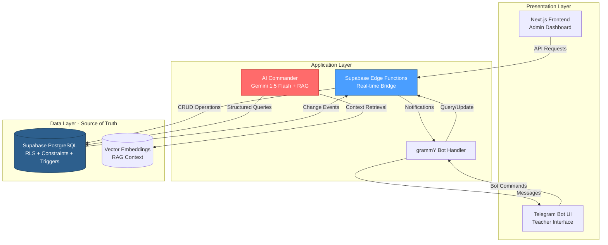
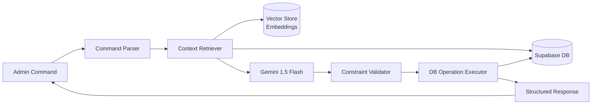
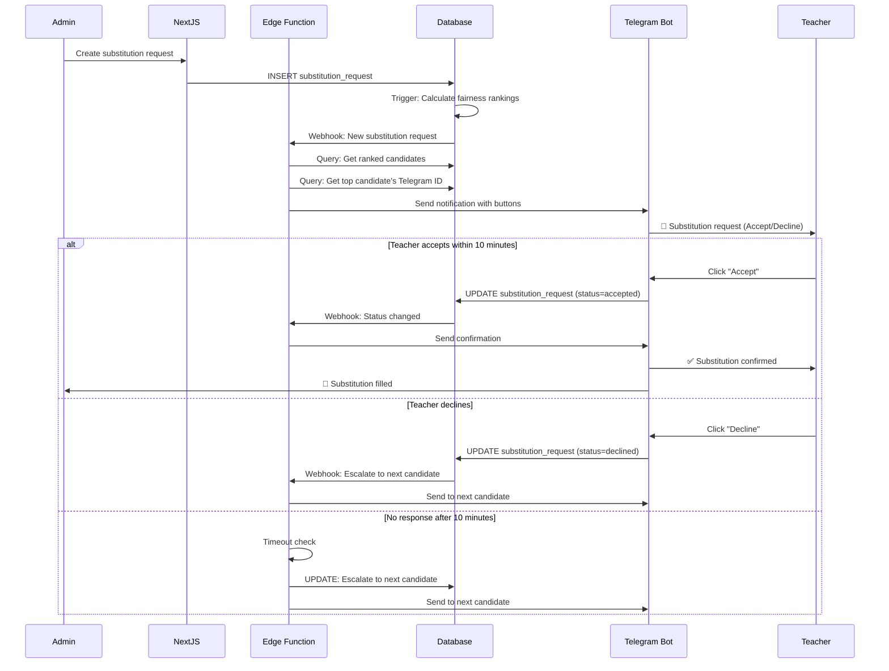
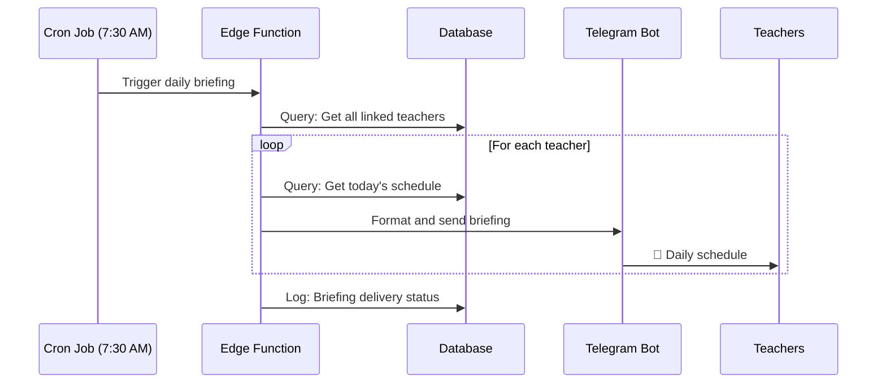
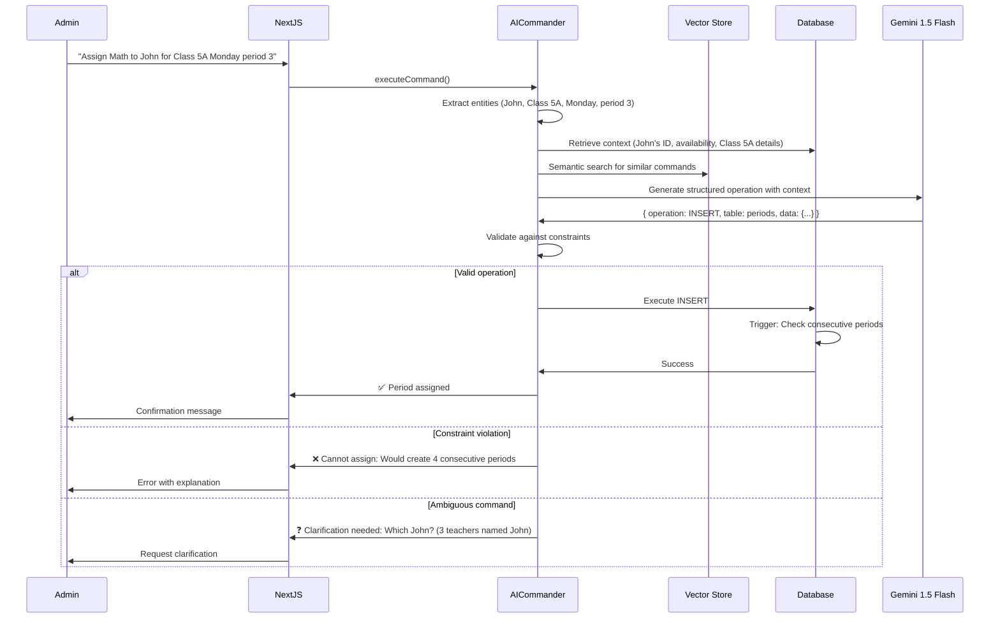
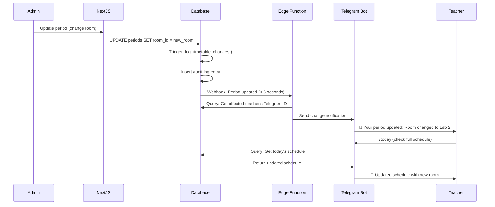
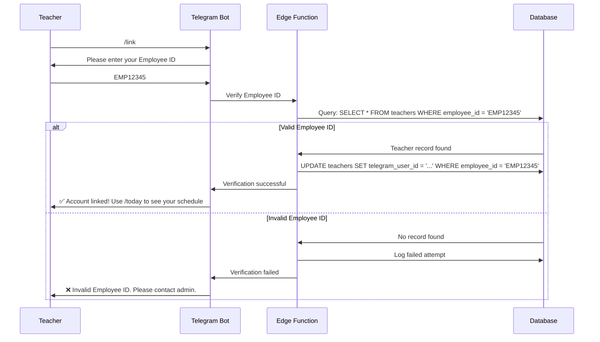
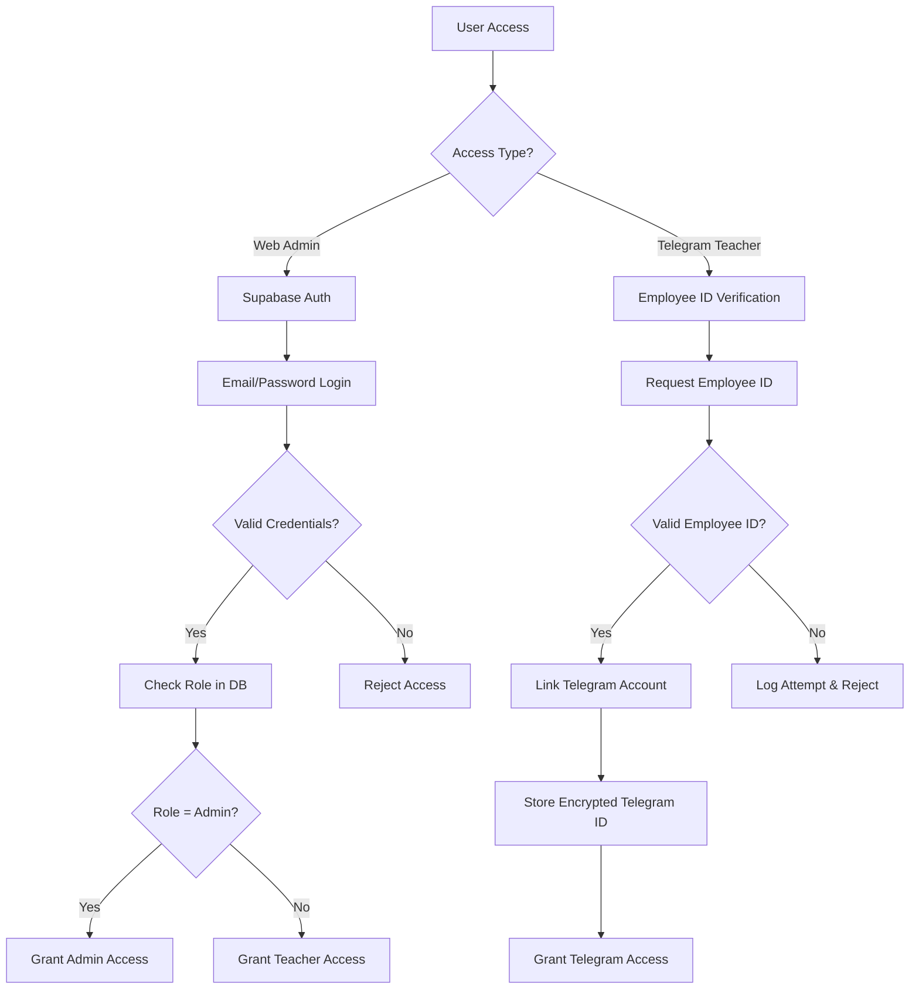

# Design Document: Anti-Gravity School Timetable Management System

## Overview

The Anti-Gravity School Timetable Management System is a three-layer architecture that enforces scheduling rules at the database level, provides real-time communication through edge functions, and enables natural language administration through AI. The system manages timetables for three academic wings (Nursery/Blossom, Scholar, Master) with automated burnout protection, fair substitution distribution, and intelligent scheduling assistance.

### Core Design Principles

1. **Database as Source of Truth**: All scheduling rules, constraints, and business logic are enforced at the PostgreSQL database level through check constraints, triggers, and RLS policies. This ensures data integrity regardless of UI bugs or API misuse.

2. **Edge Functions as Bridge**: Supabase Edge Functions serve as the real-time notification layer, triggered by database changes to deliver instant Telegram notifications within 5 seconds.

3. **AI Commander as Brain**: A RAG-based AI interface using Gemini 1.5 Flash retrieves current timetable context from the database before executing natural language commands, preventing hallucinations and ensuring accuracy.

4. **Modular Enforcement**: Scheduling rules (consecutive period limits, wing constraints, double-booking prevention) are implemented as database constraints, not UI validation, making them impossible to bypass.

### Technology Stack

- **Database**: Supabase PostgreSQL with RLS, triggers, and check constraints
- **Backend**: Supabase Edge Functions (Deno runtime)
- **Frontend**: Next.js 14 with App Router, React Server Components
- **Telegram Bot**: grammY framework for interactive notifications
- **AI**: Google Gemini 1.5 Flash with RAG pattern for context retrieval
- **Authentication**: Supabase Auth with Employee ID verification
- **Deployment**: Vercel (frontend), Supabase (backend + edge functions)

## Architecture


### High-Level Architecture Diagram



### Three-Layer Architecture


**Layer 1: Database as Source of Truth**

The PostgreSQL database enforces all scheduling rules through:
- Check constraints for consecutive period limits (max 3 teaching periods)
- Foreign key constraints for referential integrity (teachers, classes, rooms)
- Unique constraints for double-booking prevention (teacher-time, room-time)
- Triggers for automatic rest period insertion after 3 consecutive periods
- RLS policies for role-based data access (teachers see only their data, admins see all)
- Database functions for Fairness Index calculation and substitution ranking

**Layer 2: Edge Functions as Bridge**

Supabase Edge Functions provide the real-time notification layer:
- Triggered by database change events (INSERT, UPDATE on timetable tables)
- Retrieve affected teacher Telegram IDs from the database
- Format and send notifications via Telegram Bot API
- Handle substitution request workflows (send, accept, decline, escalate)
- Execute within 5 seconds of database commit
- Implement retry logic with exponential backoff for reliability

**Layer 3: AI Commander as Brain**

The AI Commander uses RAG to ground responses in actual data:
- Receives natural language commands from admins
- Retrieves relevant context from database (teacher availability, current assignments, constraints)
- Generates embeddings for semantic search of timetable data
- Parses commands into structured database operations
- Validates operations against constraints before execution
- Responds within 3 seconds with confirmation or clarification requests
- Logs all commands for audit trail

## Components and Interfaces


### Database Schema

```sql
-- Wings table
CREATE TABLE wings (
  id UUID PRIMARY KEY DEFAULT gen_random_uuid(),
  name TEXT NOT NULL UNIQUE CHECK (name IN ('Blossom', 'Scholar', 'Master')),
  description TEXT,
  created_at TIMESTAMPTZ DEFAULT NOW()
);

-- Teachers table
CREATE TABLE teachers (
  id UUID PRIMARY KEY DEFAULT gen_random_uuid(),
  employee_id TEXT NOT NULL UNIQUE,
  name TEXT NOT NULL,
  telegram_user_id TEXT UNIQUE,
  telegram_linked_at TIMESTAMPTZ,
  subjects TEXT[] DEFAULT '{}',
  role TEXT NOT NULL CHECK (role IN ('teacher', 'admin')),
  created_at TIMESTAMPTZ DEFAULT NOW(),
  updated_at TIMESTAMPTZ DEFAULT NOW()
);

-- Classes table
CREATE TABLE classes (
  id UUID PRIMARY KEY DEFAULT gen_random_uuid(),
  name TEXT NOT NULL,
  wing_id UUID NOT NULL REFERENCES wings(id),
  class_teacher_id UUID REFERENCES teachers(id),
  grade_level INTEGER,
  created_at TIMESTAMPTZ DEFAULT NOW(),
  UNIQUE(name, wing_id)
);

-- Rooms table
CREATE TABLE rooms (
  id UUID PRIMARY KEY DEFAULT gen_random_uuid(),
  name TEXT NOT NULL UNIQUE,
  capacity INTEGER,
  wing_id UUID REFERENCES wings(id),
  created_at TIMESTAMPTZ DEFAULT NOW()
);


-- Periods table (core timetable data)
CREATE TABLE periods (
  id UUID PRIMARY KEY DEFAULT gen_random_uuid(),
  teacher_id UUID NOT NULL REFERENCES teachers(id),
  class_id UUID NOT NULL REFERENCES classes(id),
  room_id UUID REFERENCES rooms(id),
  wing_id UUID NOT NULL REFERENCES wings(id),
  subject TEXT NOT NULL,
  day_of_week INTEGER NOT NULL CHECK (day_of_week BETWEEN 0 AND 6),
  period_number INTEGER NOT NULL CHECK (period_number BETWEEN 0 AND 10),
  start_time TIME NOT NULL,
  end_time TIME NOT NULL,
  is_period_zero BOOLEAN DEFAULT FALSE,
  period_type TEXT NOT NULL DEFAULT 'teaching' CHECK (period_type IN ('teaching', 'rest', 'prep', 'break', 'lunch')),
  created_at TIMESTAMPTZ DEFAULT NOW(),
  updated_at TIMESTAMPTZ DEFAULT NOW(),
  
  -- Prevent double-booking of teachers
  UNIQUE(teacher_id, day_of_week, period_number),
  
  -- Prevent double-booking of rooms
  UNIQUE(room_id, day_of_week, period_number),
  
  -- Ensure end time is after start time
  CHECK (end_time > start_time)
);

-- Index for fast teacher schedule queries
CREATE INDEX idx_periods_teacher_day ON periods(teacher_id, day_of_week);
CREATE INDEX idx_periods_class_day ON periods(class_id, day_of_week);
CREATE INDEX idx_periods_wing ON periods(wing_id);


-- Substitution requests table
CREATE TABLE substitution_requests (
  id UUID PRIMARY KEY DEFAULT gen_random_uuid(),
  original_teacher_id UUID NOT NULL REFERENCES teachers(id),
  period_id UUID NOT NULL REFERENCES periods(id),
  requested_by UUID NOT NULL REFERENCES teachers(id),
  assigned_teacher_id UUID REFERENCES teachers(id),
  status TEXT NOT NULL DEFAULT 'pending' CHECK (status IN ('pending', 'assigned', 'accepted', 'declined', 'expired', 'cancelled')),
  fairness_ranking JSONB, -- Stores ranked list of candidates with fairness scores
  expiration_time TIMESTAMPTZ NOT NULL,
  created_at TIMESTAMPTZ DEFAULT NOW(),
  updated_at TIMESTAMPTZ DEFAULT NOW(),
  
  -- Ensure expiration is in the future when created
  CHECK (expiration_time > created_at)
);

CREATE INDEX idx_substitution_status ON substitution_requests(status);
CREATE INDEX idx_substitution_expiration ON substitution_requests(expiration_time) WHERE status = 'pending';

-- Audit log table
CREATE TABLE audit_logs (
  id UUID PRIMARY KEY DEFAULT gen_random_uuid(),
  table_name TEXT NOT NULL,
  record_id UUID NOT NULL,
  action TEXT NOT NULL CHECK (action IN ('INSERT', 'UPDATE', 'DELETE')),
  old_data JSONB,
  new_data JSONB,
  changed_by UUID REFERENCES teachers(id),
  changed_at TIMESTAMPTZ DEFAULT NOW(),
  ip_address INET
);

CREATE INDEX idx_audit_logs_table_record ON audit_logs(table_name, record_id);
CREATE INDEX idx_audit_logs_timestamp ON audit_logs(changed_at);


-- Database function: Calculate Fairness Index for a teacher
CREATE OR REPLACE FUNCTION calculate_fairness_index(teacher_uuid UUID, target_week DATE)
RETURNS INTEGER AS $$
DECLARE
  teaching_count INTEGER;
  substitution_count INTEGER;
BEGIN
  -- Count regular teaching periods for the week
  SELECT COUNT(*) INTO teaching_count
  FROM periods
  WHERE teacher_id = teacher_uuid
    AND period_type = 'teaching'
    AND day_of_week BETWEEN 0 AND 6;
  
  -- Count accepted substitutions for the week
  SELECT COUNT(*) INTO substitution_count
  FROM substitution_requests sr
  JOIN periods p ON sr.period_id = p.id
  WHERE sr.assigned_teacher_id = teacher_uuid
    AND sr.status = 'accepted'
    AND p.start_time >= target_week
    AND p.start_time < target_week + INTERVAL '7 days';
  
  RETURN teaching_count + substitution_count;
END;
$$ LANGUAGE plpgsql STABLE;

-- Database function: Check consecutive teaching periods
CREATE OR REPLACE FUNCTION check_consecutive_periods()
RETURNS TRIGGER AS $$
DECLARE
  consecutive_count INTEGER;
BEGIN
  -- Only check for teaching periods
  IF NEW.period_type != 'teaching' THEN
    RETURN NEW;
  END IF;
  
  -- Count consecutive teaching periods before this one
  SELECT COUNT(*) INTO consecutive_count
  FROM periods
  WHERE teacher_id = NEW.teacher_id
    AND day_of_week = NEW.day_of_week
    AND period_number < NEW.period_number
    AND period_number >= NEW.period_number - 2
    AND period_type = 'teaching';
  
  -- Reject if this would create 4 consecutive teaching periods
  IF consecutive_count >= 3 THEN
    RAISE EXCEPTION 'Cannot assign fourth consecutive teaching period. Teacher needs rest after 3 consecutive periods.';
  END IF;
  
  RETURN NEW;
END;
$$ LANGUAGE plpgsql;

CREATE TRIGGER enforce_consecutive_limit
  BEFORE INSERT OR UPDATE ON periods
  FOR EACH ROW
  EXECUTE FUNCTION check_consecutive_periods();


-- Trigger: Auto-insert rest period after 3 consecutive teaching periods
CREATE OR REPLACE FUNCTION auto_insert_rest_period()
RETURNS TRIGGER AS $$
BEGIN
  -- Check if this is the 3rd consecutive teaching period
  IF NEW.period_type = 'teaching' AND
     (SELECT COUNT(*) FROM periods
      WHERE teacher_id = NEW.teacher_id
        AND day_of_week = NEW.day_of_week
        AND period_number < NEW.period_number
        AND period_number >= NEW.period_number - 2
        AND period_type = 'teaching') = 2 THEN
    
    -- Insert rest period in the next slot if it doesn't exist
    INSERT INTO periods (teacher_id, class_id, wing_id, subject, day_of_week, period_number, start_time, end_time, period_type)
    SELECT NEW.teacher_id, NEW.class_id, NEW.wing_id, 'Rest', NEW.day_of_week, NEW.period_number + 1,
           NEW.end_time, NEW.end_time + INTERVAL '45 minutes', 'rest'
    WHERE NOT EXISTS (
      SELECT 1 FROM periods
      WHERE teacher_id = NEW.teacher_id
        AND day_of_week = NEW.day_of_week
        AND period_number = NEW.period_number + 1
    );
  END IF;
  
  RETURN NEW;
END;
$$ LANGUAGE plpgsql;

CREATE TRIGGER auto_rest_after_three
  AFTER INSERT OR UPDATE ON periods
  FOR EACH ROW
  EXECUTE FUNCTION auto_insert_rest_period();

-- Trigger: Audit log for all timetable changes
CREATE OR REPLACE FUNCTION log_timetable_changes()
RETURNS TRIGGER AS $$
BEGIN
  IF TG_OP = 'DELETE' THEN
    INSERT INTO audit_logs (table_name, record_id, action, old_data, changed_by)
    VALUES (TG_TABLE_NAME, OLD.id, 'DELETE', row_to_json(OLD), auth.uid());
    RETURN OLD;
  ELSIF TG_OP = 'UPDATE' THEN
    INSERT INTO audit_logs (table_name, record_id, action, old_data, new_data, changed_by)
    VALUES (TG_TABLE_NAME, NEW.id, 'UPDATE', row_to_json(OLD), row_to_json(NEW), auth.uid());
    RETURN NEW;
  ELSIF TG_OP = 'INSERT' THEN
    INSERT INTO audit_logs (table_name, record_id, action, new_data, changed_by)
    VALUES (TG_TABLE_NAME, NEW.id, 'INSERT', row_to_json(NEW), auth.uid());
    RETURN NEW;
  END IF;
END;
$$ LANGUAGE plpgsql;

CREATE TRIGGER audit_periods
  AFTER INSERT OR UPDATE OR DELETE ON periods
  FOR EACH ROW
  EXECUTE FUNCTION log_timetable_changes();

CREATE TRIGGER audit_substitution_requests
  AFTER INSERT OR UPDATE OR DELETE ON substitution_requests
  FOR EACH ROW
  EXECUTE FUNCTION log_timetable_changes();


-- Row Level Security Policies

-- Teachers can only read their own data
CREATE POLICY teacher_read_own_data ON teachers
  FOR SELECT
  USING (auth.uid() = id OR (SELECT role FROM teachers WHERE id = auth.uid()) = 'admin');

-- Teachers can only read their own periods
CREATE POLICY teacher_read_own_periods ON periods
  FOR SELECT
  USING (teacher_id = auth.uid() OR (SELECT role FROM teachers WHERE id = auth.uid()) = 'admin');

-- Only admins can modify periods
CREATE POLICY admin_modify_periods ON periods
  FOR ALL
  USING ((SELECT role FROM teachers WHERE id = auth.uid()) = 'admin');

-- Teachers can read substitution requests assigned to them
CREATE POLICY teacher_read_substitutions ON substitution_requests
  FOR SELECT
  USING (
    assigned_teacher_id = auth.uid() OR
    original_teacher_id = auth.uid() OR
    (SELECT role FROM teachers WHERE id = auth.uid()) = 'admin'
  );

-- Teachers can update substitution requests assigned to them (accept/decline)
CREATE POLICY teacher_update_substitutions ON substitution_requests
  FOR UPDATE
  USING (assigned_teacher_id = auth.uid())
  WITH CHECK (assigned_teacher_id = auth.uid() AND status IN ('accepted', 'declined'));

-- Only admins can read audit logs
CREATE POLICY admin_read_audit_logs ON audit_logs
  FOR SELECT
  USING ((SELECT role FROM teachers WHERE id = auth.uid()) = 'admin');

-- Enable RLS on all tables
ALTER TABLE teachers ENABLE ROW LEVEL SECURITY;
ALTER TABLE periods ENABLE ROW LEVEL SECURITY;
ALTER TABLE substitution_requests ENABLE ROW LEVEL SECURITY;
ALTER TABLE audit_logs ENABLE ROW LEVEL SECURITY;
```


### Next.js Frontend Component Design

**Component Hierarchy:**

```
app/
├── layout.tsx                    # Root layout with auth provider
├── page.tsx                      # Landing page
├── (auth)/
│   ├── login/page.tsx           # Employee ID login
│   └── link-telegram/page.tsx   # Telegram linking flow
├── (dashboard)/
│   ├── layout.tsx               # Dashboard layout with navigation
│   ├── timetable/
│   │   ├── page.tsx             # Weekly timetable view
│   │   └── [wingId]/page.tsx   # Wing-specific timetable
│   ├── substitutions/
│   │   ├── page.tsx             # Substitution marketplace
│   │   └── [requestId]/page.tsx # Substitution detail
│   ├── admin/
│   │   ├── page.tsx             # Admin dashboard
│   │   ├── ai-commander/page.tsx # Natural language interface
│   │   └── audit-logs/page.tsx  # Audit log viewer
│   └── profile/page.tsx         # Teacher profile
└── api/
    ├── telegram-webhook/route.ts # Telegram bot webhook
    └── ai-command/route.ts       # AI Commander endpoint

components/
├── TimetableGrid.tsx            # Weekly grid display
├── PeriodCard.tsx               # Individual period display
├── SubstitutionCard.tsx         # Substitution request card
├── FairnessIndicator.tsx        # Visual fairness index
├── AICommandInput.tsx           # Natural language input
└── AuditLogTable.tsx            # Audit log display
```


**Key Component Interfaces:**

```typescript
// TimetableGrid Component
interface TimetableGridProps {
  wingId?: string;
  teacherId?: string;
  weekStart: Date;
  editable?: boolean;
}

// PeriodCard Component
interface PeriodCardProps {
  period: {
    id: string;
    subject: string;
    className: string;
    roomName: string;
    startTime: string;
    endTime: string;
    periodType: 'teaching' | 'rest' | 'prep' | 'break' | 'lunch';
  };
  onEdit?: (periodId: string) => void;
  onDelete?: (periodId: string) => void;
}

// SubstitutionCard Component
interface SubstitutionCardProps {
  request: {
    id: string;
    originalTeacher: string;
    period: PeriodCardProps['period'];
    fairnessRanking: Array<{
      teacherId: string;
      teacherName: string;
      fairnessIndex: number;
      expertiseMatch: boolean;
    }>;
    status: 'pending' | 'assigned' | 'accepted' | 'declined' | 'expired';
    expirationTime: string;
  };
  onAssign?: (teacherId: string) => void;
}

// AICommandInput Component
interface AICommandInputProps {
  onCommandSubmit: (command: string) => Promise<{
    success: boolean;
    message: string;
    operations?: Array<{ type: string; data: any }>;
  }>;
  placeholder?: string;
}
```


### Telegram Bot Design (grammY)

**Bot Command Structure:**

```typescript
// Bot initialization
import { Bot, InlineKeyboard } from 'grammy';

const bot = new Bot(process.env.TELEGRAM_BOT_TOKEN);

// Command handlers
bot.command('start', async (ctx) => {
  await ctx.reply('Welcome to Anti-Gravity Timetable! Use /link to connect your account.');
});

bot.command('link', async (ctx) => {
  await ctx.reply('Please enter your Employee ID to link your account:');
  // Store conversation state for next message
});

bot.command('today', async (ctx) => {
  // Fetch today's schedule from database
  const schedule = await fetchDailySchedule(ctx.from.id);
  await ctx.reply(formatSchedule(schedule));
});

bot.command('week', async (ctx) => {
  // Fetch weekly schedule
  const schedule = await fetchWeeklySchedule(ctx.from.id);
  await ctx.reply(formatSchedule(schedule));
});

// Callback query handlers for interactive buttons
bot.on('callback_query:data', async (ctx) => {
  const data = JSON.parse(ctx.callbackQuery.data);
  
  if (data.action === 'accept_substitution') {
    await handleSubstitutionAccept(ctx, data.requestId);
  } else if (data.action === 'decline_substitution') {
    await handleSubstitutionDecline(ctx, data.requestId);
  }
});
```


**Substitution Notification Format:**

```typescript
async function sendSubstitutionNotification(
  telegramUserId: string,
  request: SubstitutionRequest
) {
  const keyboard = new InlineKeyboard()
    .text('✅ Accept', JSON.stringify({ action: 'accept_substitution', requestId: request.id }))
    .text('❌ Decline', JSON.stringify({ action: 'decline_substitution', requestId: request.id }));

  const message = `
🔔 Substitution Request

📚 Subject: ${request.subject}
👥 Class: ${request.className}
🏫 Room: ${request.roomName}
⏰ Time: ${request.startTime} - ${request.endTime}
📊 Your Fairness Index: ${request.yourFairnessIndex}

Original teacher: ${request.originalTeacherName}
Reason: ${request.reason}

⏳ Respond within 10 minutes or it will be escalated.
  `.trim();

  await bot.api.sendMessage(telegramUserId, message, {
    reply_markup: keyboard,
  });
}
```

**Daily Briefing Format:**

```typescript
async function sendDailyBriefing(telegramUserId: string, schedule: Period[]) {
  const date = new Date().toLocaleDateString('en-US', { 
    weekday: 'long', 
    year: 'numeric', 
    month: 'long', 
    day: 'numeric' 
  });

  if (schedule.length === 0) {
    await bot.api.sendMessage(
      telegramUserId,
      `📅 ${date}\n\n✨ You have no scheduled periods today. Enjoy your free day!`
    );
    return;
  }

  const periods = schedule.map((p, i) => 
    `${i + 1}. ${p.startTime}-${p.endTime} | ${p.subject} | ${p.className} | Room ${p.roomName}`
  ).join('\n');

  const message = `
📅 ${date}

Your schedule for today:

${periods}

Have a great day! 🎓
  `.trim();

  await bot.api.sendMessage(telegramUserId, message);
}
```


### Supabase Edge Functions

**Edge Function: notify-timetable-change**

```typescript
// supabase/functions/notify-timetable-change/index.ts
import { serve } from 'https://deno.land/std@0.168.0/http/server.ts';
import { createClient } from 'https://esm.sh/@supabase/supabase-js@2';

serve(async (req) => {
  try {
    const { record, old_record, type } = await req.json();
    
    // Initialize Supabase client
    const supabase = createClient(
      Deno.env.get('SUPABASE_URL')!,
      Deno.env.get('SUPABASE_SERVICE_ROLE_KEY')!
    );
    
    // Get affected teacher's Telegram ID
    const { data: teacher } = await supabase
      .from('teachers')
      .select('telegram_user_id, name')
      .eq('id', record.teacher_id)
      .single();
    
    if (!teacher?.telegram_user_id) {
      return new Response('Teacher not linked to Telegram', { status: 200 });
    }
    
    // Format notification message
    let message = '';
    if (type === 'INSERT') {
      message = `✨ New period added:\n${formatPeriod(record)}`;
    } else if (type === 'UPDATE') {
      message = `📝 Period updated:\n${formatPeriodChange(old_record, record)}`;
    } else if (type === 'DELETE') {
      message = `🗑️ Period removed:\n${formatPeriod(old_record)}`;
    }
    
    // Send Telegram notification
    await fetch(`https://api.telegram.org/bot${Deno.env.get('TELEGRAM_BOT_TOKEN')}/sendMessage`, {
      method: 'POST',
      headers: { 'Content-Type': 'application/json' },
      body: JSON.stringify({
        chat_id: teacher.telegram_user_id,
        text: message,
        parse_mode: 'Markdown',
      }),
    });
    
    return new Response('Notification sent', { status: 200 });
  } catch (error) {
    console.error('Error:', error);
    return new Response(JSON.stringify({ error: error.message }), { status: 500 });
  }
});
```


**Edge Function: process-substitution-request**

```typescript
// supabase/functions/process-substitution-request/index.ts
import { serve } from 'https://deno.land/std@0.168.0/http/server.ts';
import { createClient } from 'https://esm.sh/@supabase/supabase-js@2';

serve(async (req) => {
  try {
    const { requestId } = await req.json();
    
    const supabase = createClient(
      Deno.env.get('SUPABASE_URL')!,
      Deno.env.get('SUPABASE_SERVICE_ROLE_KEY')!
    );
    
    // Get substitution request details
    const { data: request } = await supabase
      .from('substitution_requests')
      .select('*, periods(*), teachers(*)')
      .eq('id', requestId)
      .single();
    
    // Calculate fairness index for all eligible teachers
    const { data: allTeachers } = await supabase
      .from('teachers')
      .select('*')
      .neq('id', request.original_teacher_id);
    
    const rankings = [];
    for (const teacher of allTeachers) {
      // Check availability (no conflicting period)
      const { data: conflicts } = await supabase
        .from('periods')
        .select('id')
        .eq('teacher_id', teacher.id)
        .eq('day_of_week', request.periods.day_of_week)
        .eq('period_number', request.periods.period_number);
      
      if (conflicts.length > 0) continue;
      
      // Calculate fairness index
      const { data: fairnessResult } = await supabase
        .rpc('calculate_fairness_index', {
          teacher_uuid: teacher.id,
          target_week: new Date(),
        });
      
      // Check expertise match
      const expertiseMatch = teacher.subjects.includes(request.periods.subject);
      
      rankings.push({
        teacherId: teacher.id,
        teacherName: teacher.name,
        fairnessIndex: fairnessResult,
        expertiseMatch,
        score: expertiseMatch ? fairnessResult - 100 : fairnessResult, // Bonus for expertise
      });
    }
    
    // Sort by score (lower is better)
    rankings.sort((a, b) => a.score - b.score);
    
    // Update request with rankings
    await supabase
      .from('substitution_requests')
      .update({ fairness_ranking: rankings })
      .eq('id', requestId);
    
    // Send notification to top candidate
    if (rankings.length > 0) {
      const topCandidate = rankings[0];
      const { data: teacher } = await supabase
        .from('teachers')
        .select('telegram_user_id')
        .eq('id', topCandidate.teacherId)
        .single();
      
      if (teacher?.telegram_user_id) {
        await sendSubstitutionNotification(teacher.telegram_user_id, {
          ...request,
          yourFairnessIndex: topCandidate.fairnessIndex,
        });
        
        // Update request status
        await supabase
          .from('substitution_requests')
          .update({ 
            status: 'assigned', 
            assigned_teacher_id: topCandidate.teacherId 
          })
          .eq('id', requestId);
      }
    }
    
    return new Response(JSON.stringify({ rankings }), { status: 200 });
  } catch (error) {
    console.error('Error:', error);
    return new Response(JSON.stringify({ error: error.message }), { status: 500 });
  }
});
```


### AI Commander Design (RAG Pattern with Gemini 1.5 Flash)

**Architecture:**



**RAG Implementation:**

```typescript
// lib/ai-commander.ts
import { GoogleGenerativeAI } from '@google/generative-ai';
import { createClient } from '@supabase/supabase-js';

const genAI = new GoogleGenerativeAI(process.env.GEMINI_API_KEY);
const model = genAI.getGenerativeModel({ model: 'gemini-1.5-flash' });

interface CommandContext {
  teachers: any[];
  periods: any[];
  classes: any[];
  constraints: string[];
}

export class AICommander {
  private supabase = createClient(
    process.env.NEXT_PUBLIC_SUPABASE_URL!,
    process.env.SUPABASE_SERVICE_ROLE_KEY!
  );

  async executeCommand(command: string, adminId: string): Promise<CommandResult> {
    const startTime = Date.now();
    
    // Step 1: Retrieve relevant context from database
    const context = await this.retrieveContext(command);
    
    // Step 2: Generate structured operation using Gemini
    const operation = await this.parseCommandWithContext(command, context);
    
    // Step 3: Validate against constraints
    const validation = await this.validateOperation(operation);
    if (!validation.valid) {
      return {
        success: false,
        message: `Cannot execute: ${validation.reason}`,
        executionTime: Date.now() - startTime,
      };
    }
    
    // Step 4: Execute database operation
    const result = await this.executeOperation(operation, adminId);
    
    return {
      success: true,
      message: result.message,
      operations: result.operations,
      executionTime: Date.now() - startTime,
    };
  }

  private async retrieveContext(command: string): Promise<CommandContext> {
    // Extract entities from command (teacher names, class names, subjects, times)
    const entities = await this.extractEntities(command);
    
    // Retrieve relevant teachers
    const teachers = await this.supabase
      .from('teachers')
      .select('*')
      .or(entities.teachers.map(t => `name.ilike.%${t}%`).join(','));
    
    // Retrieve relevant periods
    const periods = await this.supabase
      .from('periods')
      .select('*, teachers(*), classes(*)')
      .in('teacher_id', entities.teacherIds || [])
      .in('class_id', entities.classIds || []);
    
    // Retrieve relevant classes
    const classes = await this.supabase
      .from('classes')
      .select('*')
      .or(entities.classes.map(c => `name.ilike.%${c}%`).join(','));
    
    // Get constraint rules
    const constraints = [
      'Maximum 3 consecutive teaching periods per teacher',
      'No double-booking of teachers or rooms',
      'Period Zero must be assigned to class teacher',
      'Teachers cannot be assigned to multiple wings',
    ];
    
    return {
      teachers: teachers.data || [],
      periods: periods.data || [],
      classes: classes.data || [],
      constraints,
    };
  }


  private async parseCommandWithContext(
    command: string,
    context: CommandContext
  ): Promise<DatabaseOperation> {
    const prompt = `
You are an AI assistant for a school timetable management system. Parse the following natural language command into a structured database operation.

Command: "${command}"

Available Context:
Teachers: ${JSON.stringify(context.teachers.map(t => ({ id: t.id, name: t.name, subjects: t.subjects })))}
Current Periods: ${JSON.stringify(context.periods.map(p => ({ teacher: p.teachers.name, class: p.classes.name, subject: p.subject, day: p.day_of_week, period: p.period_number })))}
Classes: ${JSON.stringify(context.classes.map(c => ({ id: c.id, name: c.name, wing: c.wing_id })))}

Constraints:
${context.constraints.map((c, i) => `${i + 1}. ${c}`).join('\n')}

Generate a JSON response with the following structure:
{
  "operation": "INSERT" | "UPDATE" | "DELETE",
  "table": "periods" | "teachers" | "classes" | "substitution_requests",
  "data": { /* operation-specific data */ },
  "reasoning": "Brief explanation of the operation",
  "ambiguities": ["List any unclear aspects that need clarification"]
}

If the command is ambiguous or violates constraints, set "operation" to "CLARIFY" and explain in "reasoning".
    `.trim();

    const result = await model.generateContent(prompt);
    const response = result.response.text();
    
    // Parse JSON from response (handle markdown code blocks)
    const jsonMatch = response.match(/```json\n([\s\S]*?)\n```/) || response.match(/\{[\s\S]*\}/);
    if (!jsonMatch) {
      throw new Error('Failed to parse AI response');
    }
    
    return JSON.parse(jsonMatch[1] || jsonMatch[0]);
  }

  private async validateOperation(operation: DatabaseOperation): Promise<ValidationResult> {
    if (operation.operation === 'CLARIFY') {
      return { valid: false, reason: operation.reasoning };
    }
    
    // Validate against database constraints
    if (operation.table === 'periods' && operation.operation === 'INSERT') {
      // Check consecutive period limit
      const { data: existingPeriods } = await this.supabase
        .from('periods')
        .select('*')
        .eq('teacher_id', operation.data.teacher_id)
        .eq('day_of_week', operation.data.day_of_week)
        .eq('period_type', 'teaching')
        .order('period_number');
      
      // Check if this would create 4 consecutive periods
      const consecutiveCount = this.countConsecutive(
        existingPeriods || [],
        operation.data.period_number
      );
      
      if (consecutiveCount >= 3) {
        return {
          valid: false,
          reason: 'This would create 4 consecutive teaching periods, violating burnout protection rules.',
        };
      }
      
      // Check double-booking
      const { data: conflicts } = await this.supabase
        .from('periods')
        .select('id')
        .eq('teacher_id', operation.data.teacher_id)
        .eq('day_of_week', operation.data.day_of_week)
        .eq('period_number', operation.data.period_number);
      
      if (conflicts && conflicts.length > 0) {
        return {
          valid: false,
          reason: 'Teacher is already assigned to another period at this time.',
        };
      }
    }
    
    return { valid: true };
  }

  private async executeOperation(
    operation: DatabaseOperation,
    adminId: string
  ): Promise<ExecutionResult> {
    const { data, error } = await this.supabase
      .from(operation.table)
      [operation.operation.toLowerCase()](operation.data);
    
    if (error) {
      throw new Error(`Database operation failed: ${error.message}`);
    }
    
    return {
      message: `Successfully ${operation.operation.toLowerCase()}ed ${operation.table} record`,
      operations: [operation],
    };
  }

  private countConsecutive(periods: any[], newPeriodNumber: number): number {
    let count = 0;
    for (let i = newPeriodNumber - 1; i >= newPeriodNumber - 3 && i >= 0; i--) {
      if (periods.some(p => p.period_number === i && p.period_type === 'teaching')) {
        count++;
      } else {
        break;
      }
    }
    return count;
  }

  private async extractEntities(command: string): Promise<any> {
    // Simple entity extraction (can be enhanced with NER)
    const teacherPattern = /teacher\s+([A-Z][a-z]+(?:\s+[A-Z][a-z]+)*)/gi;
    const classPattern = /class\s+([A-Z0-9-]+)/gi;
    
    const teachers = [...command.matchAll(teacherPattern)].map(m => m[1]);
    const classes = [...command.matchAll(classPattern)].map(m => m[1]);
    
    return { teachers, classes };
  }
}
```


**Example AI Command Flows:**

```typescript
// Example 1: Assign a period
const command = "Assign Math to teacher John Smith for Class 5A on Monday period 3";
// AI retrieves: John Smith's ID, Class 5A's ID, checks availability
// Generates: INSERT into periods with validated data

// Example 2: Create substitution request
const command = "Find a substitute for Sarah Johnson's English class tomorrow at 10 AM";
// AI retrieves: Sarah's schedule, available teachers, fairness indices
// Generates: INSERT into substitution_requests with ranked candidates

// Example 3: Ambiguous command
const command = "Move the math class";
// AI response: CLARIFY - "Which math class? There are 5 math classes scheduled. Please specify the class name and current time."
```

## Data Models


### Core Data Models

```typescript
// Teacher Model
interface Teacher {
  id: string;
  employeeId: string;
  name: string;
  telegramUserId?: string;
  telegramLinkedAt?: Date;
  subjects: string[];
  role: 'teacher' | 'admin';
  createdAt: Date;
  updatedAt: Date;
}

// Wing Model
interface Wing {
  id: string;
  name: 'Blossom' | 'Scholar' | 'Master';
  description: string;
  createdAt: Date;
}

// Class Model
interface Class {
  id: string;
  name: string;
  wingId: string;
  classTeacherId?: string;
  gradeLevel: number;
  createdAt: Date;
}

// Room Model
interface Room {
  id: string;
  name: string;
  capacity: number;
  wingId?: string;
  createdAt: Date;
}

// Period Model
interface Period {
  id: string;
  teacherId: string;
  classId: string;
  roomId?: string;
  wingId: string;
  subject: string;
  dayOfWeek: number; // 0-6 (Sunday-Saturday)
  periodNumber: number; // 0-10 (0 is Period Zero)
  startTime: string; // HH:MM format
  endTime: string; // HH:MM format
  isPeriodZero: boolean;
  periodType: 'teaching' | 'rest' | 'prep' | 'break' | 'lunch';
  createdAt: Date;
  updatedAt: Date;
}

// Substitution Request Model
interface SubstitutionRequest {
  id: string;
  originalTeacherId: string;
  periodId: string;
  requestedBy: string;
  assignedTeacherId?: string;
  status: 'pending' | 'assigned' | 'accepted' | 'declined' | 'expired' | 'cancelled';
  fairnessRanking?: FairnessRanking[];
  expirationTime: Date;
  createdAt: Date;
  updatedAt: Date;
}

// Fairness Ranking Model
interface FairnessRanking {
  teacherId: string;
  teacherName: string;
  fairnessIndex: number;
  expertiseMatch: boolean;
  score: number;
}

// Audit Log Model
interface AuditLog {
  id: string;
  tableName: string;
  recordId: string;
  action: 'INSERT' | 'UPDATE' | 'DELETE';
  oldData?: Record<string, any>;
  newData?: Record<string, any>;
  changedBy?: string;
  changedAt: Date;
  ipAddress?: string;
}
```


### Data Flow Diagrams

**Workflow 1: Substitution Request Creation and Assignment**




**Workflow 2: Daily Briefing Delivery**



**Workflow 3: AI Commander Natural Language Processing**




**Workflow 4: Real-Time Timetable Synchronization**



**Workflow 5: Teacher Identity Verification and Telegram Linking**




### Security Architecture

**Role-Based Access Control (RBAC)**

```typescript
// RLS Policy Implementation
const RLSPolicies = {
  teachers: {
    select: 'auth.uid() = id OR (SELECT role FROM teachers WHERE id = auth.uid()) = "admin"',
    insert: '(SELECT role FROM teachers WHERE id = auth.uid()) = "admin"',
    update: 'auth.uid() = id OR (SELECT role FROM teachers WHERE id = auth.uid()) = "admin"',
    delete: '(SELECT role FROM teachers WHERE id = auth.uid()) = "admin"',
  },
  periods: {
    select: 'teacher_id = auth.uid() OR (SELECT role FROM teachers WHERE id = auth.uid()) = "admin"',
    insert: '(SELECT role FROM teachers WHERE id = auth.uid()) = "admin"',
    update: '(SELECT role FROM teachers WHERE id = auth.uid()) = "admin"',
    delete: '(SELECT role FROM teachers WHERE id = auth.uid()) = "admin"',
  },
  substitution_requests: {
    select: `
      assigned_teacher_id = auth.uid() OR 
      original_teacher_id = auth.uid() OR 
      (SELECT role FROM teachers WHERE id = auth.uid()) = "admin"
    `,
    update: `
      assigned_teacher_id = auth.uid() AND 
      status IN ('accepted', 'declined')
    `,
  },
  audit_logs: {
    select: '(SELECT role FROM teachers WHERE id = auth.uid()) = "admin"',
  },
};
```

**Data Encryption Strategy**

1. **At Rest**: 
   - AES-256 encryption for all database tables (Supabase default)
   - Encrypted backups with 90-day key rotation
   - Sensitive fields (telegram_user_id, employee_id) use additional column-level encryption

2. **In Transit**:
   - TLS 1.3 for all API communications
   - HTTPS-only for Next.js frontend
   - Telegram Bot API uses HTTPS by default

3. **Data Masking**:
   ```typescript
   // Mask sensitive data in logs
   function maskSensitiveData(data: any): any {
     return {
       ...data,
       employeeId: data.employeeId ? `***${data.employeeId.slice(-4)}` : undefined,
       telegramUserId: data.telegramUserId ? '***MASKED***' : undefined,
     };
   }
   ```


**Authentication Flow**



**API Security Measures**

```typescript
// Middleware for API route protection
export async function withAuth(handler: NextApiHandler, requiredRole?: 'admin') {
  return async (req: NextApiRequest, res: NextApiResponse) => {
    // Verify Supabase JWT
    const token = req.headers.authorization?.replace('Bearer ', '');
    if (!token) {
      return res.status(401).json({ error: 'Unauthorized' });
    }
    
    const supabase = createClient(
      process.env.NEXT_PUBLIC_SUPABASE_URL!,
      process.env.SUPABASE_SERVICE_ROLE_KEY!
    );
    
    const { data: { user }, error } = await supabase.auth.getUser(token);
    if (error || !user) {
      return res.status(401).json({ error: 'Invalid token' });
    }
    
    // Check role if required
    if (requiredRole) {
      const { data: teacher } = await supabase
        .from('teachers')
        .select('role')
        .eq('id', user.id)
        .single();
      
      if (teacher?.role !== requiredRole) {
        return res.status(403).json({ error: 'Insufficient permissions' });
      }
    }
    
    // Attach user to request
    req.user = user;
    return handler(req, res);
  };
}

// Rate limiting for AI Commander
const rateLimiter = new Map<string, { count: number; resetAt: number }>();

export function checkRateLimit(userId: string, maxRequests = 10, windowMs = 60000): boolean {
  const now = Date.now();
  const userLimit = rateLimiter.get(userId);
  
  if (!userLimit || now > userLimit.resetAt) {
    rateLimiter.set(userId, { count: 1, resetAt: now + windowMs });
    return true;
  }
  
  if (userLimit.count >= maxRequests) {
    return false;
  }
  
  userLimit.count++;
  return true;
}
```


### Performance Optimization Strategies

**1. Database Query Optimization**

```sql
-- Composite indexes for common queries
CREATE INDEX idx_periods_teacher_day_period ON periods(teacher_id, day_of_week, period_number);
CREATE INDEX idx_periods_class_day ON periods(class_id, day_of_week);
CREATE INDEX idx_substitution_active ON substitution_requests(status, expiration_time) 
  WHERE status IN ('pending', 'assigned');

-- Materialized view for fairness index calculation (refresh every 5 minutes)
CREATE MATERIALIZED VIEW teacher_workload AS
SELECT 
  t.id as teacher_id,
  t.name,
  COUNT(p.id) FILTER (WHERE p.period_type = 'teaching') as regular_periods,
  COUNT(sr.id) FILTER (WHERE sr.status = 'accepted') as substitution_periods,
  COUNT(p.id) FILTER (WHERE p.period_type = 'teaching') + 
    COUNT(sr.id) FILTER (WHERE sr.status = 'accepted') as total_workload
FROM teachers t
LEFT JOIN periods p ON p.teacher_id = t.id
LEFT JOIN substitution_requests sr ON sr.assigned_teacher_id = t.id
GROUP BY t.id, t.name;

CREATE UNIQUE INDEX idx_teacher_workload ON teacher_workload(teacher_id);

-- Refresh materialized view periodically
CREATE OR REPLACE FUNCTION refresh_teacher_workload()
RETURNS void AS $$
BEGIN
  REFRESH MATERIALIZED VIEW CONCURRENTLY teacher_workload;
END;
$$ LANGUAGE plpgsql;
```

**2. Edge Function Performance**

```typescript
// Connection pooling for database queries
import { createClient } from '@supabase/supabase-js';

// Reuse client across function invocations
let supabaseClient: any = null;

function getSupabaseClient() {
  if (!supabaseClient) {
    supabaseClient = createClient(
      Deno.env.get('SUPABASE_URL')!,
      Deno.env.get('SUPABASE_SERVICE_ROLE_KEY')!,
      {
        db: {
          schema: 'public',
        },
        global: {
          headers: { 'x-connection-pool': 'true' },
        },
      }
    );
  }
  return supabaseClient;
}

// Batch notifications to reduce API calls
async function sendBatchNotifications(notifications: Array<{ chatId: string; message: string }>) {
  const batchSize = 30; // Telegram rate limit: 30 messages/second
  const batches = [];
  
  for (let i = 0; i < notifications.length; i += batchSize) {
    batches.push(notifications.slice(i, i + batchSize));
  }
  
  for (const batch of batches) {
    await Promise.all(
      batch.map(n => 
        fetch(`https://api.telegram.org/bot${Deno.env.get('TELEGRAM_BOT_TOKEN')}/sendMessage`, {
          method: 'POST',
          headers: { 'Content-Type': 'application/json' },
          body: JSON.stringify({ chat_id: n.chatId, text: n.message }),
        })
      )
    );
    
    // Wait 1 second between batches to respect rate limits
    if (batches.indexOf(batch) < batches.length - 1) {
      await new Promise(resolve => setTimeout(resolve, 1000));
    }
  }
}
```


**3. AI Commander Performance (3-Second Target)**

```typescript
// Caching strategy for AI responses
import { LRUCache } from 'lru-cache';

const commandCache = new LRUCache<string, CommandResult>({
  max: 500,
  ttl: 1000 * 60 * 5, // 5 minutes
});

export class AICommander {
  async executeCommand(command: string, adminId: string): Promise<CommandResult> {
    // Check cache first
    const cacheKey = `${command.toLowerCase().trim()}_${adminId}`;
    const cached = commandCache.get(cacheKey);
    if (cached) {
      return { ...cached, fromCache: true };
    }
    
    // Set timeout for 3-second limit
    const timeoutPromise = new Promise<CommandResult>((_, reject) => 
      setTimeout(() => reject(new Error('Command execution timeout')), 3000)
    );
    
    const executionPromise = this.executeCommandInternal(command, adminId);
    
    try {
      const result = await Promise.race([executionPromise, timeoutPromise]);
      commandCache.set(cacheKey, result);
      return result;
    } catch (error) {
      if (error.message === 'Command execution timeout') {
        return {
          success: false,
          message: 'Command processing took too long. Please try a simpler command or contact support.',
          executionTime: 3000,
        };
      }
      throw error;
    }
  }
  
  private async executeCommandInternal(command: string, adminId: string): Promise<CommandResult> {
    const startTime = Date.now();
    
    // Parallel context retrieval and entity extraction
    const [context, entities] = await Promise.all([
      this.retrieveContext(command),
      this.extractEntities(command),
    ]);
    
    // Use streaming for faster AI response
    const operation = await this.parseCommandWithContext(command, context);
    
    // Validate and execute
    const validation = await this.validateOperation(operation);
    if (!validation.valid) {
      return {
        success: false,
        message: validation.reason,
        executionTime: Date.now() - startTime,
      };
    }
    
    const result = await this.executeOperation(operation, adminId);
    
    return {
      ...result,
      executionTime: Date.now() - startTime,
    };
  }
}
```

**4. Real-Time Sync Performance (5-Second Target)**

```typescript
// Optimized webhook handler with timeout
export async function handleTimetableChange(payload: any) {
  const startTime = Date.now();
  const TIMEOUT_MS = 5000;
  
  try {
    // Set aggressive timeout
    const controller = new AbortController();
    const timeoutId = setTimeout(() => controller.abort(), TIMEOUT_MS);
    
    // Fetch only necessary data
    const { data: teacher } = await supabase
      .from('teachers')
      .select('telegram_user_id, name')
      .eq('id', payload.record.teacher_id)
      .single()
      .abortSignal(controller.signal);
    
    clearTimeout(timeoutId);
    
    if (!teacher?.telegram_user_id) {
      console.log('Teacher not linked, skipping notification');
      return;
    }
    
    // Send notification asynchronously (don't wait for Telegram API)
    sendTelegramNotification(teacher.telegram_user_id, formatChange(payload))
      .catch(err => console.error('Notification failed:', err));
    
    const elapsed = Date.now() - startTime;
    console.log(`Webhook processed in ${elapsed}ms`);
    
  } catch (error) {
    console.error('Webhook error:', error);
    // Log to monitoring service
  }
}
```


**5. Frontend Performance**

```typescript
// React Server Components for initial load
// app/timetable/page.tsx
export default async function TimetablePage() {
  // Fetch data on server
  const supabase = createServerClient();
  const { data: periods } = await supabase
    .from('periods')
    .select('*, teachers(*), classes(*), rooms(*)')
    .order('day_of_week, period_number');
  
  return <TimetableGrid periods={periods} />;
}

// Client-side caching with SWR
import useSWR from 'swr';

export function useTimetable(wingId?: string) {
  const { data, error, mutate } = useSWR(
    `/api/timetable${wingId ? `?wing=${wingId}` : ''}`,
    fetcher,
    {
      refreshInterval: 30000, // Refresh every 30 seconds
      revalidateOnFocus: true,
      dedupingInterval: 5000,
    }
  );
  
  return {
    periods: data,
    isLoading: !error && !data,
    isError: error,
    refresh: mutate,
  };
}

// Optimistic updates for better UX
async function updatePeriod(periodId: string, updates: Partial<Period>) {
  // Update UI immediately
  mutate(
    `/api/timetable`,
    (current) => current.map(p => p.id === periodId ? { ...p, ...updates } : p),
    false
  );
  
  // Send update to server
  try {
    await fetch(`/api/periods/${periodId}`, {
      method: 'PATCH',
      body: JSON.stringify(updates),
    });
    
    // Revalidate from server
    mutate(`/api/timetable`);
  } catch (error) {
    // Revert on error
    mutate(`/api/timetable`);
    throw error;
  }
}
```

**6. Scalability Considerations**

- **Database**: Supabase PostgreSQL can handle 100+ concurrent connections with connection pooling
- **Edge Functions**: Auto-scale based on load, cold start < 100ms
- **Telegram Bot**: Rate-limited to 30 messages/second, batch processing for daily briefings
- **AI Commander**: Request queuing with max 10 concurrent Gemini API calls
- **Frontend**: CDN caching for static assets, ISR for timetable pages (revalidate every 60s)

**Performance Targets:**

| Operation | Target | Strategy |
|-----------|--------|----------|
| AI Command Response | < 3 seconds | Caching, parallel queries, streaming |
| Real-time Notification | < 5 seconds | Async processing, connection pooling |
| Timetable Page Load | < 2 seconds | RSC, CDN, database indexes |
| Substitution Ranking | < 3 seconds | Materialized views, batch calculation |
| Daily Briefing (100 teachers) | < 5 minutes | Batch processing, parallel sends |


## Correctness Properties

A property is a characteristic or behavior that should hold true across all valid executions of a system—essentially, a formal statement about what the system should do. Properties serve as the bridge between human-readable specifications and machine-verifiable correctness guarantees.

### Property Reflection

After analyzing all acceptance criteria, the following redundancies were identified and resolved:

- **5.2 and 5.1**: Both test expertise-based prioritization. Combined into Property 5.
- **11.3 and 11.1**: Both test teacher data access restrictions. Combined into Property 11.
- **13.1 and 13.4**: Both test AI substitution performance (3-second limit). Combined into Property 13.

The following properties represent the unique, testable correctness requirements:


### Property 1: Wing Isolation

For any period query, filtering by wing before retrieval produces the same result as retrieving all periods then filtering by wing (query order independence).

**Validates: Requirements 1.1, 1.4**

### Property 2: Wing Constraint Enforcement

For any period insertion, if the teacher already has periods in a different wing, the database shall reject the insertion.

**Validates: Requirements 1.2, 1.3**

### Property 3: Automatic Rest Period Insertion

For any teacher schedule, when three consecutive teaching periods are assigned, the system shall automatically create a rest or prep period in the fourth slot.

**Validates: Requirements 2.1**

### Property 4: Consecutive Period Limit

For any period insertion attempt, if it would create four consecutive teaching periods for a teacher, the database shall reject the insertion.

**Validates: Requirements 2.2, 15.1**

### Property 5: Consecutive Period Calculation

For any teacher schedule, inserting a non-teaching period (break, lunch) between teaching periods shall reset the consecutive teaching period count.

**Validates: Requirements 2.3**

### Property 6: Consecutive Period Invariant

For any valid teacher schedule in the database, the maximum count of consecutive teaching periods shall be less than or equal to three.

**Validates: Requirements 2.4, 15.5**

### Property 7: Period Zero Assignment

For any class with a designated class teacher, Period Zero shall be assigned to that class teacher.

**Validates: Requirements 3.1**

### Property 8: Period Zero Substitution Performance

For any Period Zero substitution request, the system shall generate ranked suggestions within 3 seconds.

**Validates: Requirements 3.2**

### Property 9: Period Zero Substitution Availability

For any Period Zero substitution suggestion list, all suggested teachers shall have no conflicting periods at Period Zero time.

**Validates: Requirements 3.3**

### Property 10: Period Zero Restoration Round-Trip

For any class teacher, marking them absent then marking them present shall restore their Period Zero assignment to the original state.

**Validates: Requirements 3.4**


### Property 11: Fairness Index Calculation Performance

For any substitution request, the system shall calculate Fairness Index for all eligible teachers within 3 seconds.

**Validates: Requirements 4.1**

### Property 12: Fairness Index Ranking Order

For any substitution candidate ranking list, candidates shall be sorted by Fairness Index in ascending order (lowest workload first).

**Validates: Requirements 4.2**

### Property 13: Fairness Index Definition

For any teacher, the Fairness Index shall equal the sum of regular teaching periods plus accepted substitution periods for the week.

**Validates: Requirements 4.3**

### Property 14: Fairness Index Monotonicity

For any teacher, accepting a substitution period then recalculating Fairness Index shall increase the index value.

**Validates: Requirements 4.4**

### Property 15: Fairness Index Tiebreaker

For any two teachers with equal Fairness Index, the teacher with expertise match for the subject shall rank higher in substitution suggestions.

**Validates: Requirements 4.5**

### Property 16: Expertise-Based Prioritization

For any substitution candidate ranking, teachers with subject expertise match shall appear before teachers without expertise match when fairness indices differ by less than a threshold.

**Validates: Requirements 5.1, 5.2**

### Property 17: Fallback to Fairness Index

For any substitution request where no teachers have expertise match, the ranking shall be ordered solely by Fairness Index in ascending order.

**Validates: Requirements 5.3**

### Property 18: Substitution Ranking Completeness

For any substitution ranking entry, it shall contain both expertise match status and Fairness Index value.

**Validates: Requirements 5.4**

### Property 19: Employee ID Validation

For any Telegram linking attempt with an invalid Employee ID, the system shall reject the link and log the attempt.

**Validates: Requirements 6.2, 6.3**

### Property 20: Telegram ID Storage Integrity

For any teacher record, the telegram_user_id field shall only be set if the employee_id has been validated.

**Validates: Requirements 6.4**


### Property 21: Daily Briefing Content Completeness

For any daily briefing message, it shall include all scheduled periods with room assignments and class details for the current day.

**Validates: Requirements 7.2**

### Property 22: Daily Briefing Retrieval Performance

For any daily briefing generation, the edge function shall retrieve and format timetable data within 5 seconds.

**Validates: Requirements 7.4**

### Property 23: Substitution Notification Performance

For any substitution request assignment, the edge function shall send a Telegram notification within 5 seconds.

**Validates: Requirements 8.1**

### Property 24: Substitution Notification Button Presence

For any substitution notification message, it shall include both Accept and Decline interactive buttons.

**Validates: Requirements 8.2**

### Property 25: Substitution Accept Performance

For any teacher accepting a substitution via Telegram, the system shall update the database and send confirmation within 3 seconds.

**Validates: Requirements 8.3**

### Property 26: Substitution Decline Escalation

For any teacher declining a substitution, the system shall notify the admin and send the request to the next ranked candidate.

**Validates: Requirements 8.4**

### Property 27: Substitution Timeout Escalation

For any substitution request with no response after 10 minutes, the system shall automatically escalate to the next candidate.

**Validates: Requirements 8.5**

### Property 28: AI Commander Context Retrieval

For any natural language command, the AI Commander shall retrieve relevant timetable context from the database before generating a response.

**Validates: Requirements 9.1, 13.3, 19.1**

### Property 29: AI Commander Performance

For any natural language command, the AI Commander shall parse and generate a structured database operation within 3 seconds.

**Validates: Requirements 9.2, 13.1, 13.4**

### Property 30: AI Commander Audit Logging

For any executed AI command, the system shall create an audit log entry with timestamp and admin identifier.

**Validates: Requirements 9.4**


### Property 31: AI Commander Constraint Validation

For any natural language command that would violate scheduling constraints, the AI Commander shall reject the command and provide an explanation of the constraint violation.

**Validates: Requirements 9.5**

### Property 32: Real-Time Change Notification Performance

For any timetable modification, the edge function shall trigger notifications to affected teachers within 5 seconds of the database commit.

**Validates: Requirements 10.1, 10.4**

### Property 33: Real-Time Change Notification Delivery

For any timetable modification affecting multiple teachers, all affected teachers shall receive change notifications.

**Validates: Requirements 10.3**

### Property 34: Teacher Data Access Restriction

For any teacher querying period data, the database shall return only periods assigned to that teacher, rejecting queries for other teachers' data.

**Validates: Requirements 11.1, 11.3**

### Property 35: Admin Full Access

For any admin querying timetable data, the database shall permit access to all records regardless of teacher assignment.

**Validates: Requirements 11.2**

### Property 36: Admin Access Audit Logging

For any admin accessing timetable data, the system shall create an audit log entry recording the access.

**Validates: Requirements 11.4**

### Property 37: API Authentication Enforcement

For any API request without valid authentication, the system shall reject the request before executing any database operations.

**Validates: Requirements 11.5**

### Property 38: Log Data Masking

For any application log entry containing teacher data, Employee IDs and Telegram user IDs shall be masked.

**Validates: Requirements 12.3**

### Property 39: UI Data Masking

For any non-admin user viewing teacher data in the UI, sensitive fields shall be masked.

**Validates: Requirements 12.4**

### Property 40: AI Substitution Ranking Factors

For any AI-generated substitution ranking, the calculation shall consider Fairness Index, Expertise Match, and teacher availability.

**Validates: Requirements 13.2**


### Property 41: Foreign Key Constraint Enforcement

For any period insertion with an invalid teacher_id or class_id, the database shall reject the insertion due to foreign key constraint violation.

**Validates: Requirements 15.2**

### Property 42: Double-Booking Prevention

For any period insertion that would create a duplicate teacher-time or room-time combination, the database shall reject the insertion due to unique constraint violation.

**Validates: Requirements 15.3**

### Property 43: Database Error Descriptiveness

For any invalid data insertion attempt, the database shall return a descriptive error message indicating the constraint violation.

**Validates: Requirements 15.4**

### Property 44: Timetable Parser Valid Input

For any valid timetable file, the parser shall successfully parse it into database-compatible objects without errors.

**Validates: Requirements 16.1**

### Property 45: Timetable Parser Invalid Input

For any invalid timetable file, the parser shall return a descriptive error with line number and issue description.

**Validates: Requirements 16.2**

### Property 46: Timetable Serializer Output Validity

For any database timetable object, the serializer shall produce a valid export file that can be parsed back.

**Validates: Requirements 16.3**

### Property 47: Timetable Round-Trip

For any valid timetable object, parsing then serializing then parsing shall produce an equivalent object.

**Validates: Requirements 16.4**

### Property 48: Timetable Parser Validation

For any timetable file with invalid wing assignments, teacher IDs, or period constraints, the parser shall reject the file during parsing.

**Validates: Requirements 16.5**

### Property 49: Audit Log Creation

For any timetable data modification (insert, update, delete), the database shall create an audit log entry with timestamp, user, and change details.

**Validates: Requirements 17.1**

### Property 50: Audit Log State Recording

For any update or delete operation, the audit log entry shall contain both the before state (old_data) and after state (new_data).

**Validates: Requirements 17.4**


### Property 51: Audit Log Completeness

For any database modification, an audit log entry shall exist with a timestamp matching the modification time.

**Validates: Requirements 17.5**

### Property 52: Telegram Bot Error Messages

For any error encountered by the Telegram bot, it shall send a user-friendly error message to the teacher (not a technical stack trace).

**Validates: Requirements 18.1**

### Property 53: Telegram Bot Retry Logic

For any database unavailability error, the Telegram bot shall queue the request and retry up to 3 times with exponential backoff.

**Validates: Requirements 18.2**

### Property 54: Telegram Bot Successful Retry

For any queued request that succeeds on retry, the bot shall process the request and notify the teacher of completion.

**Validates: Requirements 18.3**

### Property 55: Telegram Bot Error Logging

For any error logged by the Telegram bot, the log shall contain stack traces for debugging but mask all PII.

**Validates: Requirements 18.4**

### Property 56: Telegram Bot Retry Exhaustion

For any request where all 3 retries fail, the bot shall notify the admin of the system issue.

**Validates: Requirements 18.5**

### Property 57: AI Commander Context Completeness

For any AI command processing, the retrieved context shall include teacher availability, current assignments, and constraint rules.

**Validates: Requirements 19.2**

### Property 58: AI Commander Entity Grounding

For any AI-generated database operation, all referenced entities (teachers, classes, rooms) shall exist in the retrieved context.

**Validates: Requirements 19.5**

### Property 59: Substitution Request Expiration Timestamp

For any newly created substitution request, the expiration timestamp shall be set based on the period start time and be in the future.

**Validates: Requirements 20.1**

### Property 60: Substitution Request Auto-Expiration

For any substitution request where the current time exceeds the expiration timestamp, the database shall mark it as expired.

**Validates: Requirements 20.2**


### Property 61: Expired Request Query Exclusion

For any query for active substitution requests, expired requests shall not appear in the results.

**Validates: Requirements 20.3**

### Property 62: Expired Request Archival

For any expired substitution request, it shall remain in the database (not deleted) for audit purposes.

**Validates: Requirements 20.4**

### Property 63: Active Request Expiration Invariant

For any substitution request with status 'pending' or 'assigned', the current time shall be less than the expiration timestamp.

**Validates: Requirements 20.5**

## Error Handling


### Database-Level Error Handling

The database enforces constraints and returns descriptive errors:

```sql
-- Example: Consecutive period constraint violation
ERROR: Cannot assign fourth consecutive teaching period. Teacher needs rest after 3 consecutive periods.

-- Example: Double-booking violation
ERROR: duplicate key value violates unique constraint "periods_teacher_id_day_of_week_period_number_key"
DETAIL: Key (teacher_id, day_of_week, period_number)=(uuid, 1, 3) already exists.

-- Example: Foreign key violation
ERROR: insert or update on table "periods" violates foreign key constraint "periods_teacher_id_fkey"
DETAIL: Key (teacher_id)=(invalid-uuid) is not present in table "teachers".
```

### Application-Level Error Handling

```typescript
// Error handling wrapper for all API routes
export async function handleApiError(error: any, res: NextApiResponse) {
  console.error('API Error:', maskSensitiveData(error));
  
  if (error.code === '23505') {
    // Unique constraint violation
    return res.status(409).json({
      error: 'Conflict',
      message: 'This time slot is already booked. Please choose a different time.',
    });
  }
  
  if (error.code === '23503') {
    // Foreign key violation
    return res.status(400).json({
      error: 'Invalid Reference',
      message: 'The referenced teacher, class, or room does not exist.',
    });
  }
  
  if (error.code === 'P0001') {
    // Custom database exception (e.g., consecutive period limit)
    return res.status(400).json({
      error: 'Constraint Violation',
      message: error.message,
    });
  }
  
  if (error.message?.includes('timeout')) {
    return res.status(504).json({
      error: 'Timeout',
      message: 'The operation took too long. Please try again.',
    });
  }
  
  // Generic error
  return res.status(500).json({
    error: 'Internal Server Error',
    message: 'An unexpected error occurred. Please contact support.',
  });
}
```


### Telegram Bot Error Handling

```typescript
// Retry logic with exponential backoff
async function executeWithRetry<T>(
  operation: () => Promise<T>,
  maxRetries = 3
): Promise<T> {
  let lastError: Error;
  
  for (let attempt = 0; attempt < maxRetries; attempt++) {
    try {
      return await operation();
    } catch (error) {
      lastError = error;
      
      // Don't retry on client errors (4xx)
      if (error.response?.status >= 400 && error.response?.status < 500) {
        throw error;
      }
      
      // Exponential backoff: 1s, 2s, 4s
      const delay = Math.pow(2, attempt) * 1000;
      console.log(`Retry attempt ${attempt + 1} after ${delay}ms`);
      await new Promise(resolve => setTimeout(resolve, delay));
    }
  }
  
  // All retries failed, notify admin
  await notifyAdmin(`Operation failed after ${maxRetries} retries: ${lastError.message}`);
  throw lastError;
}

// User-friendly error messages
function formatErrorForUser(error: any): string {
  if (error.code === 'ECONNREFUSED') {
    return 'The system is temporarily unavailable. We\'re working on it!';
  }
  
  if (error.message?.includes('timeout')) {
    return 'The request took too long. Please try again in a moment.';
  }
  
  if (error.code === '23505') {
    return 'This time slot is already taken. Please choose another time.';
  }
  
  return 'Something went wrong. Our team has been notified and will fix it soon.';
}
```

### AI Commander Error Handling

```typescript
// Graceful degradation for AI failures
export class AICommander {
  async executeCommand(command: string, adminId: string): Promise<CommandResult> {
    try {
      return await this.executeCommandInternal(command, adminId);
    } catch (error) {
      console.error('AI Commander error:', error);
      
      // If AI fails, provide manual fallback
      if (error.message?.includes('API key') || error.message?.includes('quota')) {
        return {
          success: false,
          message: 'AI assistant is temporarily unavailable. Please use the manual interface or try again later.',
          fallbackUrl: '/admin/manual-edit',
        };
      }
      
      // If parsing fails, ask for clarification
      if (error.message?.includes('parse') || error.message?.includes('ambiguous')) {
        return {
          success: false,
          message: 'I couldn\'t understand that command. Could you rephrase it or be more specific?',
          suggestions: [
            'Try: "Assign Math to John Smith for Class 5A on Monday period 3"',
            'Try: "Create substitution request for Sarah\'s English class tomorrow"',
          ],
        };
      }
      
      throw error;
    }
  }
}
```

## Testing Strategy


### Dual Testing Approach

The system requires both unit tests and property-based tests for comprehensive coverage:

- **Unit Tests**: Verify specific examples, edge cases, and error conditions
- **Property Tests**: Verify universal properties across all inputs through randomization

Both approaches are complementary and necessary. Unit tests catch concrete bugs in specific scenarios, while property tests verify general correctness across a wide input space.

### Property-Based Testing Configuration

**Library Selection:**
- **TypeScript/JavaScript**: fast-check (for Next.js frontend and Edge Functions)
- **SQL**: pgTAP (for database constraint testing)

**Test Configuration:**
- Minimum 100 iterations per property test (due to randomization)
- Each property test must reference its design document property
- Tag format: `Feature: anti-gravity-timetable-system, Property {number}: {property_text}`

**Example Property Test Structure:**

```typescript
import fc from 'fast-check';
import { describe, it, expect } from 'vitest';

describe('Feature: anti-gravity-timetable-system', () => {
  it('Property 6: Consecutive Period Invariant - For any valid teacher schedule, max consecutive teaching periods <= 3', async () => {
    await fc.assert(
      fc.asyncProperty(
        // Arbitrary: Generate random teacher schedule
        fc.array(
          fc.record({
            teacherId: fc.uuid(),
            dayOfWeek: fc.integer({ min: 0, max: 6 }),
            periodNumber: fc.integer({ min: 1, max: 10 }),
            periodType: fc.constantFrom('teaching', 'rest', 'prep', 'break', 'lunch'),
          }),
          { minLength: 1, maxLength: 50 }
        ),
        async (periods) => {
          // Insert periods into database
          const { data, error } = await supabase
            .from('periods')
            .insert(periods);
          
          if (error) {
            // If insertion fails due to constraint, that's valid
            return true;
          }
          
          // Query back and verify invariant
          const { data: schedule } = await supabase
            .from('periods')
            .select('*')
            .eq('teacher_id', periods[0].teacherId)
            .order('day_of_week, period_number');
          
          // Check consecutive teaching periods
          const maxConsecutive = calculateMaxConsecutive(schedule);
          expect(maxConsecutive).toBeLessThanOrEqual(3);
        }
      ),
      { numRuns: 100 }
    );
  });
});
```


### Unit Testing Strategy

Unit tests focus on specific examples, edge cases, and integration points:

**Database Constraint Tests:**
```typescript
describe('Database Constraints', () => {
  it('should reject fourth consecutive teaching period', async () => {
    const teacherId = 'test-teacher-uuid';
    
    // Insert 3 consecutive teaching periods
    await supabase.from('periods').insert([
      { teacher_id: teacherId, day_of_week: 1, period_number: 1, period_type: 'teaching', /* ... */ },
      { teacher_id: teacherId, day_of_week: 1, period_number: 2, period_type: 'teaching', /* ... */ },
      { teacher_id: teacherId, day_of_week: 1, period_number: 3, period_type: 'teaching', /* ... */ },
    ]);
    
    // Attempt to insert 4th consecutive period
    const { error } = await supabase.from('periods').insert({
      teacher_id: teacherId,
      day_of_week: 1,
      period_number: 4,
      period_type: 'teaching',
      /* ... */
    });
    
    expect(error).toBeDefined();
    expect(error.message).toContain('consecutive');
  });
  
  it('should prevent double-booking of teachers', async () => {
    const teacherId = 'test-teacher-uuid';
    
    // Insert first period
    await supabase.from('periods').insert({
      teacher_id: teacherId,
      day_of_week: 1,
      period_number: 3,
      /* ... */
    });
    
    // Attempt to insert conflicting period
    const { error } = await supabase.from('periods').insert({
      teacher_id: teacherId,
      day_of_week: 1,
      period_number: 3,
      /* ... */
    });
    
    expect(error).toBeDefined();
    expect(error.code).toBe('23505'); // Unique constraint violation
  });
});
```

**Edge Case Tests:**
```typescript
describe('Edge Cases', () => {
  it('should handle empty schedule for daily briefing', async () => {
    const teacherId = 'teacher-with-no-periods';
    const message = await generateDailyBriefing(teacherId, new Date());
    
    expect(message).toContain('no scheduled periods');
    expect(message).toContain('free day');
  });
  
  it('should handle teacher with no Telegram link', async () => {
    const teacherId = 'unlinked-teacher';
    const result = await sendSubstitutionNotification(teacherId, mockRequest);
    
    expect(result.sent).toBe(false);
    expect(result.reason).toBe('teacher_not_linked');
  });
  
  it('should handle expired substitution requests', async () => {
    const expiredRequest = {
      id: 'test-request',
      expiration_time: new Date(Date.now() - 1000), // 1 second ago
      status: 'pending',
    };
    
    await supabase.from('substitution_requests').insert(expiredRequest);
    
    // Query active requests
    const { data } = await supabase
      .from('substitution_requests')
      .select('*')
      .eq('status', 'pending')
      .gt('expiration_time', new Date());
    
    expect(data).not.toContainEqual(expect.objectContaining({ id: 'test-request' }));
  });
});
```


**Integration Tests:**
```typescript
describe('Substitution Workflow Integration', () => {
  it('should complete full substitution request flow', async () => {
    // 1. Create substitution request
    const { data: request } = await supabase
      .from('substitution_requests')
      .insert({
        original_teacher_id: 'teacher-a',
        period_id: 'period-123',
        requested_by: 'admin-user',
        expiration_time: new Date(Date.now() + 3600000),
      })
      .select()
      .single();
    
    // 2. Verify fairness ranking is calculated
    expect(request.fairness_ranking).toBeDefined();
    expect(request.fairness_ranking.length).toBeGreaterThan(0);
    
    // 3. Simulate teacher acceptance
    const topCandidate = request.fairness_ranking[0];
    const { data: updated } = await supabase
      .from('substitution_requests')
      .update({ status: 'accepted', assigned_teacher_id: topCandidate.teacherId })
      .eq('id', request.id)
      .select()
      .single();
    
    expect(updated.status).toBe('accepted');
    expect(updated.assigned_teacher_id).toBe(topCandidate.teacherId);
    
    // 4. Verify audit log was created
    const { data: auditLogs } = await supabase
      .from('audit_logs')
      .select('*')
      .eq('table_name', 'substitution_requests')
      .eq('record_id', request.id);
    
    expect(auditLogs.length).toBeGreaterThanOrEqual(2); // INSERT + UPDATE
  });
});

describe('AI Commander Integration', () => {
  it('should execute valid natural language command', async () => {
    const commander = new AICommander();
    const result = await commander.executeCommand(
      'Assign Math to John Smith for Class 5A on Monday period 3',
      'admin-user-id'
    );
    
    expect(result.success).toBe(true);
    expect(result.executionTime).toBeLessThan(3000);
    expect(result.operations).toHaveLength(1);
    expect(result.operations[0].operation).toBe('INSERT');
    expect(result.operations[0].table).toBe('periods');
  });
  
  it('should reject command violating constraints', async () => {
    const commander = new AICommander();
    
    // First, create 3 consecutive periods for John
    await setupConsecutivePeriods('john-smith-id', 1, [1, 2, 3]);
    
    // Try to assign 4th consecutive period
    const result = await commander.executeCommand(
      'Assign Science to John Smith for Class 5A on Monday period 4',
      'admin-user-id'
    );
    
    expect(result.success).toBe(false);
    expect(result.message).toContain('consecutive');
    expect(result.message).toContain('burnout protection');
  });
});
```


**Performance Tests:**
```typescript
describe('Performance Requirements', () => {
  it('should generate AI substitution suggestions within 3 seconds', async () => {
    const startTime = Date.now();
    
    const { data: request } = await supabase
      .from('substitution_requests')
      .insert({
        original_teacher_id: 'teacher-a',
        period_id: 'period-123',
        requested_by: 'admin-user',
        expiration_time: new Date(Date.now() + 3600000),
      })
      .select()
      .single();
    
    const elapsed = Date.now() - startTime;
    expect(elapsed).toBeLessThan(3000);
    expect(request.fairness_ranking).toBeDefined();
  });
  
  it('should send real-time notifications within 5 seconds', async () => {
    const startTime = Date.now();
    
    // Update a period
    await supabase
      .from('periods')
      .update({ room_id: 'new-room-id' })
      .eq('id', 'test-period-id');
    
    // Wait for notification to be sent (mock Telegram API)
    await waitForNotification('test-teacher-telegram-id');
    
    const elapsed = Date.now() - startTime;
    expect(elapsed).toBeLessThan(5000);
  });
  
  it('should process AI command within 3 seconds', async () => {
    const commander = new AICommander();
    const startTime = Date.now();
    
    const result = await commander.executeCommand(
      'Show me all Math classes on Monday',
      'admin-user-id'
    );
    
    const elapsed = Date.now() - startTime;
    expect(elapsed).toBeLessThan(3000);
    expect(result.success).toBe(true);
  });
});
```

### Test Coverage Goals

- **Database Constraints**: 100% coverage of all check, foreign key, and unique constraints
- **Business Logic**: 90%+ coverage of service layer functions
- **API Routes**: 85%+ coverage of all endpoints
- **Property Tests**: All 63 correctness properties implemented
- **Edge Cases**: All identified edge cases from requirements
- **Integration**: All critical workflows (substitution, AI commands, notifications)
- **Performance**: All performance requirements (3s AI, 5s notifications)

### Continuous Integration

```yaml
# .github/workflows/test.yml
name: Test Suite

on: [push, pull_request]

jobs:
  test:
    runs-on: ubuntu-latest
    
    services:
      postgres:
        image: supabase/postgres
        env:
          POSTGRES_PASSWORD: postgres
        options: >-
          --health-cmd pg_isready
          --health-interval 10s
          --health-timeout 5s
          --health-retries 5
    
    steps:
      - uses: actions/checkout@v3
      
      - name: Setup Node.js
        uses: actions/setup-node@v3
        with:
          node-version: '18'
      
      - name: Install dependencies
        run: npm ci
      
      - name: Run database migrations
        run: npm run db:migrate
      
      - name: Run unit tests
        run: npm run test:unit
      
      - name: Run property-based tests
        run: npm run test:property
      
      - name: Run integration tests
        run: npm run test:integration
      
      - name: Check coverage
        run: npm run test:coverage
      
      - name: Upload coverage
        uses: codecov/codecov-action@v3
```

---

This design document provides a comprehensive blueprint for implementing the Anti-Gravity School Timetable Management System with database-enforced constraints, real-time Telegram notifications, and AI-powered natural language administration. The three-layer architecture ensures data integrity, the modular design enables independent testing, and the property-based testing strategy guarantees correctness across all inputs.
